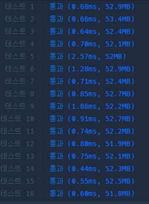
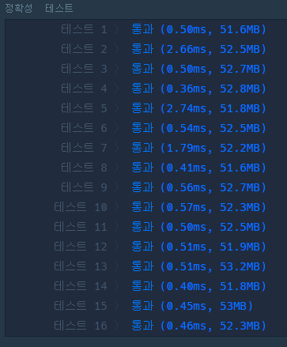

# L1\_문자열내림차순으로배치하기 정리

# 느낀점

정렬 공부해야겠다!

list 정렬 → Collections.sort

array 정렬→ Arrays.sort

StringBuilder 클래스 : reverse 메소드!

String 클래스 : new String(char[] chs ) → String 타입으로 반환!

---

## 멍청한 풀이

```java
private String solution1(String s) {
		List<Character> list = new ArrayList<>();

		//list에 문자 하나씩 담기
		for (int i = 0; i < s.length(); i++) {
			list.add(s.charAt(i));
		}

		//list 내림차순 정렬
		Collections.sort(list, new Comparator<Character>() {

			@Override
			public int compare(Character o1, Character o2) {
				return o2-o1;
			}
		});

		//list의 문자를 문자열로
		StringBuilder sb = new StringBuilder();
		for (char c : list) {
			sb.append(c);
		}

		return sb.toString();
	}
```



---

## 똑똑한 풀이

```java
private String solution2(String s) {

			char[] chs = s.toCharArray();

			Arrays.sort(chs);

			return new StringBuilder(new String(chs)).reverse().toString();
		}
```


