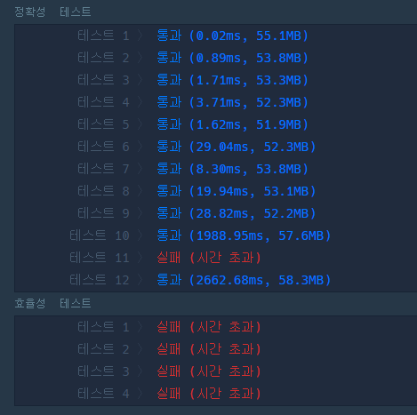
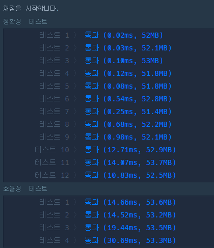

# 프로그래머스 Lv.1 소수찾기

## 처음 접근

```java
private int solution(int n) {
		List<Integer> list = new ArrayList<>();

    //2는 짝수이지만 소수이므로 미리 체크
		list.add(2);

		loop:
		for (int i = 3; i <= n; i++) {

			if(i%2==0)	continue loop;

			for(int num : list) {
				if(i%num == 0)	continue loop;
			}
            //소수이면!
			list.add(i);
		}
		return list.size();
	}
```

11번 시간초과 & 효율성 체크 빵점,,



---

## 해결책

### "에라토스테네스의 체" 활용

[에라토스테네스의 체](https://ko.wikipedia.org/wiki/%EC%97%90%EB%9D%BC%ED%86%A0%EC%8A%A4%ED%85%8C%EB%84%A4%EC%8A%A4%EC%9D%98_%EC%B2%B4)

```java
//에라토스테네스의 체 1
	private int solution(int n) {
		int answer = 0;

		//n까지의 배열 생성
		boolean[] a = new boolean[n+1];

		//모두 소수 가능성 true
		for (int i = 2; i <= n; i++) {
			a[i] = true;
		}

		for (int i = 2; i <= n; i++) {

			//소수가 아닌 경우
			if(!a[i])	continue;

			//소수인경우 해당 수의 배수는 모두 소수가 아님
			for (int j = 2*i; j <= n; j+=i) {
				a[j]=false;
			}
		}

		for (int i = 2; i <= n; i++) {
			if(a[i])	++answer;
		}

		return answer;
	}
```

```java
//에라토스테네스의 체 2
	private int solution(int n) {
		int answer = 0;

		//n까지의 배열 생성
		//모두 false로 초기화 => false : 소수이다.
		boolean[] a = new boolean[n+1];

		for (int i = 2; i <= n; i++) {

			//true : 소수가 아니다.
			if(a[i])	continue;

			//false : 소수이다.
			//소수의 배수들은 소수가 아니므로 true로 갱신
			for (int j = 2*i; j <= n; j+=i) {
				a[j]=true;
			}
		}

		//소수의 개수 카운트
		for (int i = 2; i <= n; i++) {
			if(!a[i])	++answer;
		}

		return answer;
	}
```



시간차이 심하네... 신기신기
